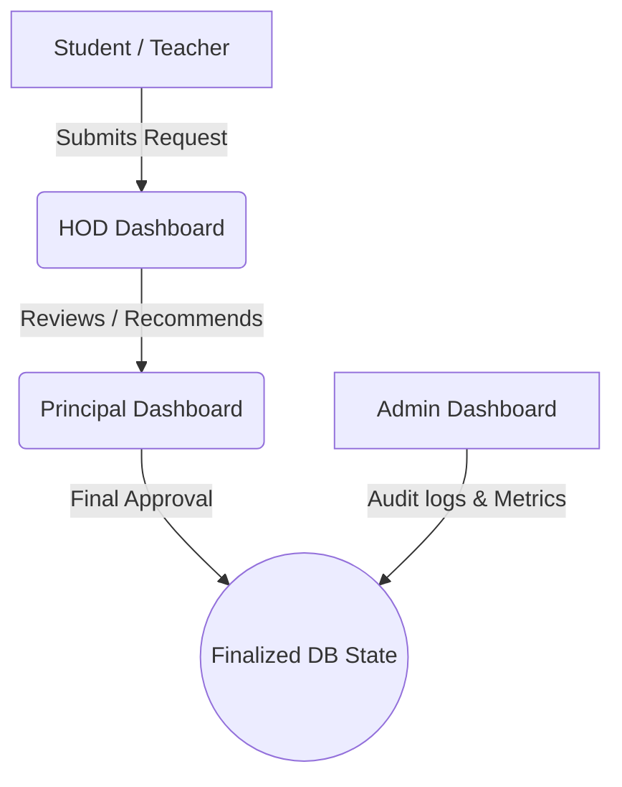

# HOD & Principal Dashboard Operations Guide

Welcome to the operations manual for the JCER ERP Head of Department (HOD) and Principal dashboards. This guide describes how the systems connect, propagate data, and process multi-stage approval workflows.

---

## 1. Login Credentials

To access and test the different portals, use the following logins:
- **Principal Portal**: `principal@college.com` / `password123`
- **HOD Portal**: `hod@college.com` / `password123`
- **Admin Portal**: `admin@college.com` / `password123`
- **Student Portal**: `student@college.com` / `password123`
- **Teacher Portal**: `teacher@college.com` / `password123`

---

## 2. System Architecture

The dashboards are built on a robust, three-tiered architecture:

### Key Engineering Principles:
1. **Department Isolation**: An HOD user is strictly isolated to their own department (e.g. CSE). All student logs, faculty workload, grievances, and syllabus modifications are queried based on the HOD's `departmentId`.
2. **workflowStage Tracking**: Instead of binary status flags, entities use `workflowStage` to determine state ownership:
   - `HOD_REVIEW`: Awaiting department review.
   - `PRINCIPAL_REVIEW`: Recommended by HOD; awaiting Principal review.
   - `ADMIN_REVIEW`: Awaiting final administrative audit.
   - `FINALIZED`: Lifecycle complete.
3. **Centralized Events**: Real-time cross-dashboard communication is managed via `backend/src/events/eventEmitter.ts` to propagate state changes without relying on API polling.

---

## 3. Workflow Implementation Details

### A. Leaves Approval Workflow
- When a Teacher submits a leave request, it begins in the `HOD_REVIEW` stage.
- **Sick / Casual Leaves**: The HOD has the authority to directly approve or reject them. The request transitions to `FINALIZED` and status becomes `APPROVED` or `REJECTED`.
- **Sabbaticals / Maternity Leaves**: The HOD reviews the request. If endorsed, the request shifts to `PRINCIPAL_REVIEW` stage (status remains `PENDING`). The Principal reviews the endorsement and makes the final decision, finalizing the ticket.

### B. Budget Requisition Workflow
- HOD submits a budget requisition detailing the item, amount, justification, and deadline from the **Budget & Resource** page.
- Requisition is logged with `workflowStage: 'PRINCIPAL_REVIEW'` and `status: 'PENDING'`.
- The request appears in the Principal's **Approval Queue**. On Principal review, status transitions to `APPROVED` or `REJECTED`, and the workflow stage is marked `FINALIZED`.
- The result reflects in real-time on the HOD's budget tracking table.

### C. Student Grievances Redressal
- Students file grievances (Academics, Hostel, Finance, etc.).
- Complaints appear in the HOD's **Grievances & Discipline** panel.
- HOD enters redressal resolution notes and submits. The grievance is marked `RESOLVED` and moves to `FINALIZED` stage, immediately appearing on the student's dashboard.

### D. Curriculum Modification Flow
- Teachers propose curriculum changes (e.g., adding AI/ML modules).
- Proposals go to the HOD's **Subject Management** panel under `HOD_REVIEW` stage.
- On HOD recommendation, the request transitions to `PRINCIPAL_REVIEW` stage.
- The Principal reviews the amendment details under the **Curriculum & Appeals** tab on the Principal's **Approvals Queue** and submits the final approve/reject decision, moving the stage to `FINALIZED`.

---

## 4. Frontend Page Directory

### HOD Portal (12 Dedicated Pages)
1. **Dashboard Hub**: Overview dashboard with real-time pass rates, active students count, performance trends, and quick actions list.
2. **Faculty Performance**: Evaluates teacher performance, workload slots, and FPIPs.
3. **Department Students**: Mentoring assignments and academic performance records.
4. **Subject Management**: Syllabus upgrades and workload balance controls.
5. **Timetable & Exams**: Exam invigilators allocation, room usage, and time slots.
6. **Budget & Finance**: Requisitions submissions and previous expenditures tracking.
7. **Leave Management**: Faculty leaves approval queue.
8. **Performance Analytics**: Performance growth graphs and satisfaction charts.
9. **Grievances Redressal**: Solves student complaints.
10. **Research & Innovation**: Publications tracking and research sponsor grants.
11. **Placements & MOUs**: Company recruiters and internship MOUs.
12. **Settings**: Notification preferences and email templates.

### Principal Portal (Approval Queue Desk)
- **Admissions approvals**: Bulk or individual student enrollment. Generates USNs/credentials.
- **Budget Requisitions**: Final sign-off on department expenditures recommended by HODs.
- **Staff requests**: Sabbatical leaves approved by HODs, hiring proposals, and promotions.
- **Curriculum & Appeals**: Authorized curriculum additions or modifications recommended by HODs.
