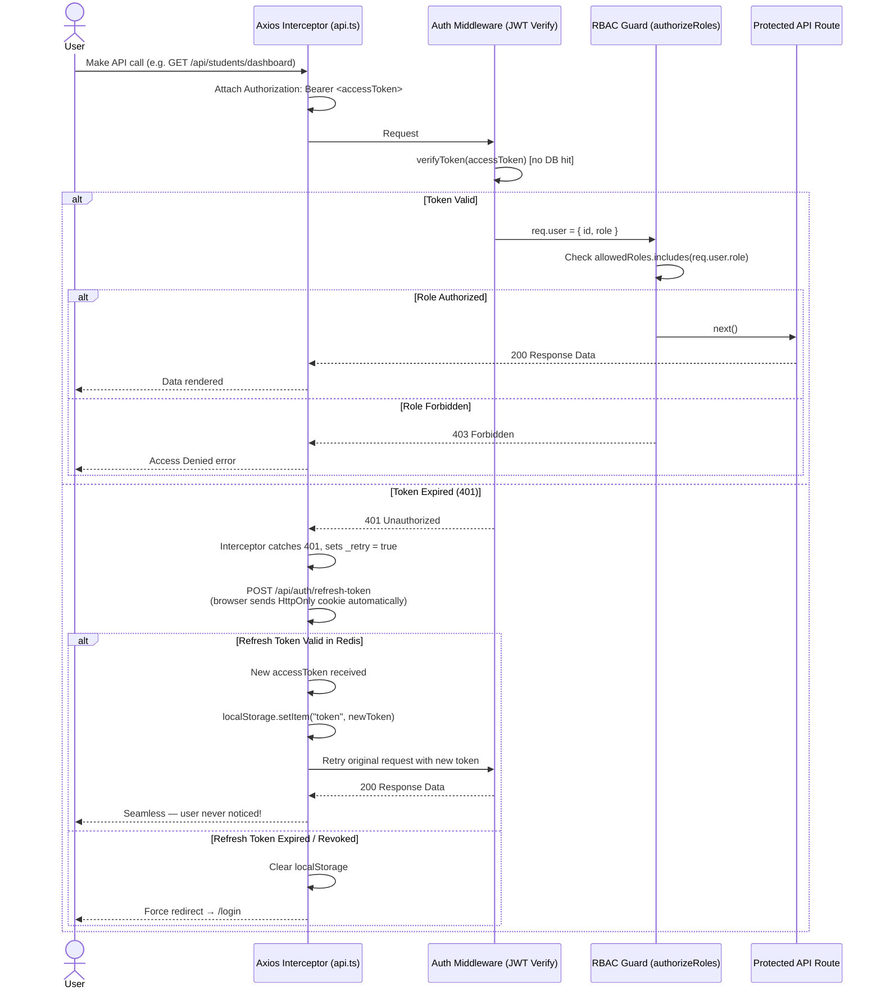

# JCER ERP — Authentication System Sequence Diagram

## 1. Login Flow

```mermaid
sequenceDiagram
    actor User
    participant LoginPage as Frontend (LoginPage.tsx)
    participant Axios as Axios (api.ts)
    participant RateLimit as Rate Limiter<br/>(authLimiter: 5/15min)
    participant AuthCtrl as Auth Controller
    participant UserModel as User Model (Sequelize)
    participant AuthSvc as Auth Service
    participant Redis as Redis (Session Store)
    participant AuditLog as Security Events<br/>(AuditLog DB)

    User->>LoginPage: Enter User ID / Email + Password
    LoginPage->>Axios: POST /api/auth/login

    Axios->>RateLimit: Request hits rate limiter
    alt Too Many Attempts
        RateLimit-->>Axios: 429 Too Many Requests
        Axios-->>LoginPage: Show error toast
    else Within Limit
        RateLimit->>AuthCtrl: Forward request (with real IP via trust proxy)

        AuthCtrl->>UserModel: findOne({ where: { email } })
        alt User Not Found
            UserModel-->>AuthCtrl: null
            AuthCtrl->>AuditLog: securityEvents.loginFailure(req, email, "User not found")
            AuthCtrl-->>Axios: 401 Invalid credentials
            Axios-->>LoginPage: Show error toast
        else User Found
            UserModel-->>AuthCtrl: User record

            alt Account Inactive / Suspended
                AuthCtrl->>AuditLog: securityEvents.loginFailure(req, email, "Account suspended", userId)
                AuthCtrl-->>Axios: 403 Account suspended
                Axios-->>LoginPage: Show error toast
            else Account Active
                AuthCtrl->>UserModel: user.comparePassword(password) [bcrypt]
                alt Password Mismatch
                    AuthCtrl->>AuditLog: securityEvents.loginFailure(req, email, "Invalid password", userId)
                    AuthCtrl-->>Axios: 401 Invalid credentials
                    Axios-->>LoginPage: Show error toast
                else Password Valid
                    AuthCtrl->>AuthSvc: generateTokens(user)
                    AuthSvc->>AuthSvc: Sign AccessToken (1h) JWT { userId, role }
                    AuthSvc->>AuthSvc: Sign RefreshToken (7d) JWT { userId }
                    AuthSvc->>Redis: setSession(userId, refreshToken) TTL 7d
                    Redis-->>AuthSvc: OK
                    AuthSvc-->>AuthCtrl: { accessToken, refreshToken }

                    AuthCtrl->>AuditLog: securityEvents.loginSuccess(req, user)
                    AuthCtrl-->>Axios: 200 { token: accessToken, user: { id, role, name } }<br/>Set-Cookie: refreshToken=...; HttpOnly; Secure; SameSite=Strict

                    Axios->>Axios: localStorage.setItem("token", accessToken)
                    Axios-->>LoginPage: { user, token }

                    LoginPage->>LoginPage: Parse user.role
                    alt STUDENT
                        LoginPage-->>User: Redirect → /student/dashboard
                    else TEACHER
                        LoginPage-->>User: Redirect → /teacher/dashboard
                    else ADMIN
                        LoginPage-->>User: Redirect → /admin/dashboard
                    else HOD
                        LoginPage-->>User: Redirect → /hod/dashboard
                    else PRINCIPAL
                        LoginPage-->>User: Redirect → /principal/dashboard
                    else PARENT
                        LoginPage-->>User: Redirect → /parent/dashboard
                    end
                end
            end
        end
    end
```

---

## 2. Authenticated API Request + Auto Token Refresh Flow



---

## 3. Logout Flow

```mermaid
sequenceDiagram
    actor User
    participant Frontend as Frontend
    participant Axios as Axios (api.ts)
    participant AuthMiddleware as Auth Middleware
    participant AuthCtrl as Auth Controller
    participant AuthSvc as Auth Service
    participant Redis as Redis (Session Store)
    participant AuditLog as Security Events<br/>(AuditLog DB)

    User->>Frontend: Click Logout
    Frontend->>Axios: POST /api/auth/logout<br/>(with Authorization: Bearer <accessToken>)
    Axios->>AuthMiddleware: Verify accessToken
    AuthMiddleware-->>AuthCtrl: req.user = { id, role }
    AuthCtrl->>AuthSvc: revokeSession(userId)
    AuthSvc->>Redis: del("session:<userId>")
    Redis-->>AuthSvc: OK
    AuthCtrl->>AuditLog: securityEvents.logout(req, userId)
    AuthCtrl-->>Axios: 200 Logged out<br/>Set-Cookie: refreshToken=; Max-Age=0 (cleared)
    Axios->>Axios: localStorage.removeItem("token", "user")
    Axios-->>Frontend: Redirect → /login
    Frontend-->>User: Login page shown
```

---

## 4. Security Layer Summary

| Layer | Technology | Protection |
|---|---|---|
| **Rate Limiting** | `express-rate-limit` | Blocks brute-force on `/login` (5/15min), `/refresh-token` (20/15min) |
| **Password Hashing** | `bcryptjs` (salt=10) | Protects passwords at rest |
| **Access Token** | JWT (1hr expiry) | Stateless, role embedded, no DB hit |
| **Refresh Token** | JWT (7d) + Redis | Stateful, revocable, httpOnly cookie |
| **Cookie Security** | `httpOnly + secure + sameSite=strict` | XSS-proof, CSRF-proof |
| **RBAC Guard** | `authorizeRoles(...roles)` | Backend enforcement, frontend redirect alone is NOT trusted |
| **Audit Logging** | `AuditLog` PostgreSQL table | Compliance-grade trail via `securityEvents` helper |
| **IP Resolution** | `trust proxy: 1` | Real client IP in logs even behind Nginx |
