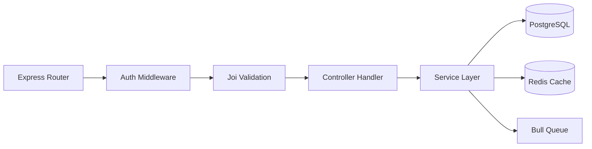

# Backend Developer Integration & Feature Guide

Welcome to the **College ERP** backend development team. This document provides a detailed breakdown of the backend architecture, database setups, how to implement each feature, and how to define contracts for frontend integration.

---

## 1. Backend Architecture & Tech Stack

Our backend is a RESTful API service built with:
* **Runtime Environment:** Node.js (v18.x or v20.x)
* **Programming Language:** TypeScript
* **Server Framework:** Express.js
* **Database ORM:** Sequelize ORM (connecting to PostgreSQL 15)
* **Caching & Queue Engine:** Redis (using `ioredis` and `bull` for queues)
* **Logging:** Winston + Morgan
* **Validation:** Joi (schema validation middleware)

### Directory Structure
```
backend/
├── src/
│   ├── config/           # DB connection, email, S3, JWT, Redis configurations
│   ├── constants/        # HTTP codes, status enums, error messages
│   ├── controllers/      # Route request handler functions
│   ├── jobs/             # Bull queue background processors (e.g. Email queue)
│   ├── middleware/       # Auth guards, RBAC check, Error Handler, rate limiters
│   ├── migrations/       # DB schema incremental update migration scripts
│   ├── models/           # Sequelize model entities
│   ├── routes/           # REST endpoint routing definitions
│   ├── seeds/            # Initial database mock seed inserters
│   ├── services/         # Business logic layer and third-party integrations
│   ├── types/            # TypeScript request/response custom typings
│   ├── utils/            # Helper scripts (JWT signer, SMS sender, PDF builders)
│   └── validators/       # Joi query/body schemas
```

---

## 2. Feature-by-Feature Implementation Guide

Here is the step-by-step guideline on how the backend developer will build and expose each core feature.



### Feature 1: Authentication & Role-Based Access Control (RBAC)
* **Description:** Expose login/session actions and verify route authorization based on Roles (`STUDENT`, `TEACHER`, `HOD`, `PRINCIPAL`, `PARENT`, `ADMIN`).
* **Backend Tasks:**
  - Create the `User` model containing `role` (ENUM), `passwordHash`, and `email` (Unique).
  - Implement a `hashPassword` hook using `bcryptjs` before creating/updating users.
  - Build standard middlewares:
    - `auth.middleware.ts`: Verifies authorization header JWT token.
    - `rbac.middleware.ts`: Rejects requests if `user.role` is not in the allowed roles list.
* **API Endpoints to Expose:**
  - `POST /api/auth/login` (Returns access token and user metadata).
  - `POST /api/auth/refresh-token` (Validates refresh tokens, signs new access token).

### Feature 2: Admission Form Submission & Review
* **Description:** Public submissions validation and approval workflows.
* **Backend Tasks:**
  - Create the `Admission` model tracking form data and validation status (`PENDING`, `VALIDATED`, `APPROVED`, `REJECTED`).
  - Implement file uploads using `multer` configured to push file objects to AWS S3.
  - Implement database transactions: When the Principal approves an admission, execute a transaction that:
    1. Updates admission status to `APPROVED`.
    2. Inserts a new `User` login entity.
    3. Inserts the corresponding `Student` profile record.
    4. Triggers an email credentials dispatch job.
* **API Endpoints to Expose:**
  - `POST /api/admission/submit` (Accepts multipart payload, runs Joi validations, creates record).
  - `PUT /api/admission/:admissionId/approve` (Principal only; runs approval transactions).

### Feature 3: Academic Attendance Register
* **Description:** Bulk marks entry with automated parent notification alerts.
* **Backend Tasks:**
  - Create the `Attendance` model (fields: `date`, `status` [PRESENT, ABSENT, LEAVE], `studentId`, `subjectId`).
  - Use `sequelize.bulkCreate` inside a database transaction to record attendance.
  - If a student is marked `ABSENT`, queue an automated SMS/Push notification alert to their associated `Parent` account via Bull queues.
* **API Endpoints to Expose:**
  - `GET /api/teachers/attendance/class` (Fetches student roster based on `subjectId`).
  - `POST /api/teachers/attendance/mark` (Receives array of student ids and statuses).

---

## 3. Step-by-Step Integration Example: Student Dashboard

Let's look at the backend implementation code for the **Student Dashboard Integration**.

### Step A: Database Migration & Associations
Create the migration `src/migrations/XXXX-create-student.ts` and ensure correct Sequelize associations:
```typescript
import { QueryInterface, DataTypes } from 'sequelize';

export async function up(queryInterface: QueryInterface) {
  await queryInterface.createTable('students', {
    id: { type: DataTypes.UUID, defaultValue: DataTypes.UUIDV4, primaryKey: true },
    enrollmentNumber: { type: DataTypes.STRING, unique: true, allowNull: false },
    userId: { type: DataTypes.UUID, references: { model: 'users', key: 'id' } },
    createdAt: { type: DataTypes.DATE, allowNull: false },
    updatedAt: { type: DataTypes.DATE, allowNull: false },
  });
}

export async function down(queryInterface: QueryInterface) {
  await queryInterface.dropTable('students');
}
```

### Step B: Build the Controller Query Logic
Create the handler function in `src/controllers/student.controller.ts` which uses Sequelize aggregation functions:
```typescript
import { Request, Response, NextFunction } from 'express';
import sequelize from '../config/database';
import Student from '../models/student.model';
import Attendance from '../models/attendance.model';

export const getStudentDashboard = async (req: Request, res: Response, next: NextFunction) => {
  try {
    const userId = req.user?.id; // Set by auth.middleware

    const student = await Student.findOne({
      where: { userId },
      attributes: ['id', 'enrollmentNumber', 'department', 'semester'],
    });

    if (!student) {
      return res.status(404).json({ error: 'Student profile not found' });
    }

    // Perform queries to calculate attendance percentages
    const totalClasses = await Attendance.count({ where: { studentId: student.id } });
    const classesPresent = await Attendance.count({ 
      where: { studentId: student.id, status: 'PRESENT' } 
    });

    const attendancePercentage = totalClasses > 0 ? (classesPresent / totalClasses) * 100 : 100;

    return res.status(200).json({
      student: {
        id: student.id,
        name: req.user?.name,
        enrollmentNumber: student.enrollmentNumber,
        department: student.department,
        semester: student.semester,
      },
      attendance: {
        percentage: parseFloat(attendancePercentage.toFixed(2)),
        status: attendancePercentage >= 75 ? 'GOOD' : 'WARNING',
        totalClasses,
        classesPresent,
      },
      academicInfo: {
        cgpa: 7.85, // Dummy or fetched from GPA aggregates
        sgpa: 8.10,
      }
    });
  } catch (error) {
    next(error); // Caught by global error handling middleware
  }
};
```

### Step C: Define the Routes & Middleware
Expose the router path in `src/routes/student.routes.ts`:
```typescript
import { Router } from 'express';
import { getStudentDashboard } from '../controllers/student.controller';
import { authenticate } from '../middleware/auth.middleware';
import { authorize } from '../middleware/rbac.middleware';

const router = Router();

// Endpoint guarded by Authentication and RBAC Role checks
router.get(
  '/dashboard',
  authenticate,
  authorize(['STUDENT']),
  getStudentDashboard
);

export default router;
```

---

## 4. Backend Developer Best Practices
1. **Never Trust Frontend Inputs:** Always run Joi/express-validator schemas on incoming payloads before accessing controller logic.
2. **Handle Errors Safely:** Never expose raw SQL/Sequelize stack traces to clients; use a global Express error handler middleware that logs complete traces internally via Winston and returns a structured `{ error: 'Message' }` JSON response with correct HTTP status codes.
3. **Optimize Database Access:** Avoid N+1 queries. Always use Sequelize `include` options for eager loading or query optimizations where needed.
4. **Use Transactions:** For operations writing to multiple tables (like registration/admissions/attendance marking), use database transaction boundaries (`sequelize.transaction`) to prevent orphan records or corrupt database states.
