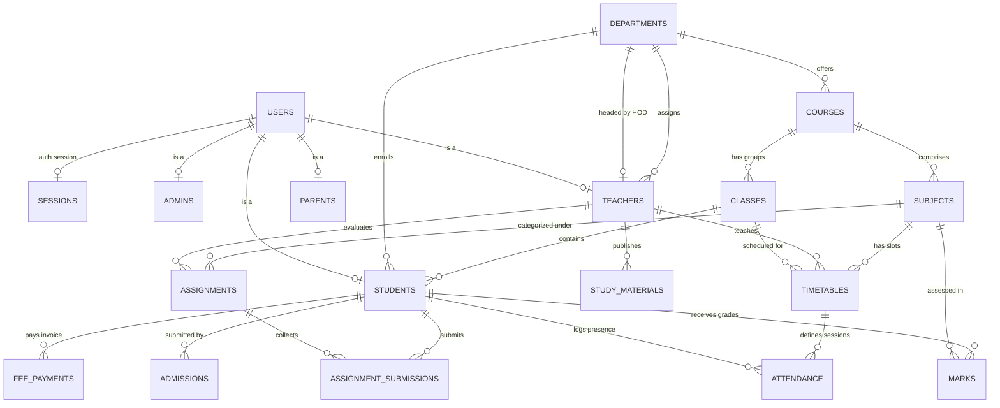

# College ERP Database Architecture & Specifications

This document provides a comprehensive technical overview of the database system, infrastructure architecture, schema design, data workflows, deployment pipelines, and operational strategies for the **College ERP** platform. It has been compiled by analyzing the system architecture, infrastructure design, schema deployment workflows, data lifecycle processes, and high-availability plans.

---

## 1. High-Level System Architecture & Infrastructure

The database layer is designed for high performance, high availability, robust security, and seamless scalability to handle millions of queries and updates across thousands of concurrent users (students, faculty, administrators, parents).

### 1.1 Infrastructure Network Topology

The production database system follows a highly resilient, master-replica pattern isolated within a dedicated private network.

```
                  ┌──────────────────────┐
                  │    Load Balancer     │
                  └──────────┬───────────┘
                             │
                             ▼
         ┌──────────────────────────────────────┐
         │          API Servers Layer           │
         │  (Node.js & Sequelize Express APIs)  │
         └────┬──────────────┬──────────────┬───┘
              │              │              │
              │              │              │ (Read/Write Queries)
              ▼              ▼              ▼
     ┌──────────────────────────────────────────────┐
     │                  PgBouncer                   │
     │      (Connection Pooler - Max 1000 Conns)    │
     └──────┬───────────────────────┬───────────────┘
            │                       │
            │ (Route Writes)        │ (Route Reads)
            ▼                       ▼
┌───────────────────────┐   ┌───────────────────────┐
│    Primary Node       │   │   Read-Only Replicas  │
│  (PostgreSQL 15 - RW) │   │ (PostgreSQL 15 - RO)  │
│      10.0.0.10        │   │  Lag: <5ms | 3 Nodes  │
└───────────┬───────────┘   └───────────▲───────────┘
            │                           │
            │  WAL Streaming            │
            └───────────────────────────┘
                    Replication Stream
```

#### PgBouncer Connection Pooler
- **Function**: Manages a central pool of database connections to minimize overhead from frequent connection creation/destruction.
- **Capacity**: Configured to support up to **1000 concurrent client connections** with a small, optimized pool size per backend thread (typically 4-10 connections/thread).
- **Traffic Routing**: Integrates with routing rules to send transactional writes directly to the Primary Node and balance select query reads across Read-Only Replicas.

#### Production Environment
- **Primary Database Server**: 
  - **Database Engine**: PostgreSQL 15 (Enterprise Grade).
  - **Instance Spec**: Primary node (Read/Write) hosting the "Master of Truth".
  - **Responsibilities**: Direct handler for all database modifying operations: `INSERT`, `UPDATE`, `DELETE`, and `TRUNCATE`.
- **Replica Database Servers**:
  - **Architecture**: A pool of three (3) active, Read-Only replica instances running PostgreSQL 15.
  - **Replication Pattern**: **Synchronous/Asynchronous WAL (Write-Ahead Logging)** streaming replication with a highly optimized replication lag of **0 - 5 milliseconds**.
  - **Responsibilities**: Handling complex analytical reporting, dashboard query requests, and general user search operations.

#### Caching Layer
- **Technology**: Redis Cluster (6-Node Distributed Setup).
- **Caching Policies**:
  - **Session Storage**: Fast lookups for active session JSON Web Tokens (JWT) and user sessions.
  - **Query Cache**: Caches output of heavy, frequently accessed queries (e.g., student grade boards, department subject lists, timetables).
  - **Real-Time Data**: Fast pub/sub for real-time notifications, chat messages, and live events.
  - **Impact**: Dramatically reduces direct DB load by handling up to **70-80% of read traffic** for static or semi-static resources.

---

## 2. Comprehensive Schema Design & ERD

The database schema is highly normalized to ensure data integrity and avoid redundancy, utilizing proper schema isolation for security and operational monitoring.

### 2.1 Schema Modules & Logical Layout



---

### 2.2 Table Definitions & Specifications

#### 2.2.1 Core Authentication & User Management

##### `users`
Stores all account details, credentials, and access control categories.

| Column Name | Data Type | Constraints | Description |
| :--- | :--- | :--- | :--- |
| `id` | `UUID` | `PRIMARY KEY`, `DEFAULT gen_random_uuid()` | Unique user identifier |
| `username` | `VARCHAR(50)` | `UNIQUE`, `NOT NULL`, `INDEX` | Unique authentication login name |
| `email` | `VARCHAR(100)` | `UNIQUE`, `NOT NULL`, `INDEX` | Contact email address |
| `password_hash`| `VARCHAR(255)`| `NOT NULL` | Hashed bcrypt password credential |
| `role` | `VARCHAR(20)` | `NOT NULL` | Enum: `admin`, `hod`, `teacher`, `student`, `parent` |
| `status` | `VARCHAR(20)` | `NOT NULL`, `DEFAULT 'active'` | Enum: `active`, `inactive`, `suspended` |
| `created_at` | `TIMESTAMP` | `NOT NULL`, `DEFAULT NOW()` | Record creation timestamp |
| `updated_at` | `TIMESTAMP` | `NOT NULL`, `DEFAULT NOW()` | Last update timestamp |

##### `sessions`
Tracks user log-in sessions and active Redis sync data.

| Column Name | Data Type | Constraints | Description |
| :--- | :--- | :--- | :--- |
| `id` | `UUID` | `PRIMARY KEY` | Unique session record ID |
| `user_id` | `UUID` | `FOREIGN KEY REFERENCES users(id)` | User owning this session |
| `token` | `VARCHAR(500)` | `NOT NULL`, `UNIQUE` | JWT authentication payload |
| `expires_at` | `TIMESTAMP` | `NOT NULL` | Absolute token expiry date |
| `created_at` | `TIMESTAMP` | `NOT NULL`, `DEFAULT NOW()` | Sign-in execution time |

---

#### 2.2.2 Academics & Departments

##### `departments`
The top-level structure mapping the college departments.

| Column Name | Data Type | Constraints | Description |
| :--- | :--- | :--- | :--- |
| `id` | `UUID` | `PRIMARY KEY` | Department identifier |
| `name` | `VARCHAR(100)` | `NOT NULL`, `UNIQUE` | Name of department (e.g., Computer Science) |
| `code` | `VARCHAR(10)` | `NOT NULL`, `UNIQUE`, `INDEX` | Short code (e.g., CSE, MECH) |
| `head_of_dept_id`| `UUID` | `FOREIGN KEY REFERENCES teachers(id)`| HOD identification |

##### `courses`
Represents degrees or major programs offered by departments.

| Column Name | Data Type | Constraints | Description |
| :--- | :--- | :--- | :--- |
| `id` | `UUID` | `PRIMARY KEY` | Course identifier |
| `name` | `VARCHAR(150)` | `NOT NULL` | Name of program (e.g., Bachelor of Technology) |
| `code` | `VARCHAR(15)` | `NOT NULL`, `UNIQUE` | Unique course code (e.g., BTECH-CSE) |
| `department_id`| `UUID` | `FOREIGN KEY REFERENCES departments(id)`| Department overseeing the course |
| `credits` | `INTEGER` | `NOT NULL` | Total credits required to complete |

##### `subjects`
Specific academic subjects or modules taught.

| Column Name | Data Type | Constraints | Description |
| :--- | :--- | :--- | :--- |
| `id` | `UUID` | `PRIMARY KEY` | Subject identifier |
| `name` | `VARCHAR(150)` | `NOT NULL` | Subject name (e.g., Database Management Systems) |
| `code` | `VARCHAR(15)` | `NOT NULL`, `UNIQUE`, `INDEX` | Subject code (e.g., CS-301) |
| `course_id` | `UUID` | `FOREIGN KEY REFERENCES courses(id)`| Academic program alignment |
| `syllabus_details`| `TEXT` | `NULL` | Syllabus documentation metadata |

---

#### 2.2.3 Users & Roles Sub-entities

##### `students`
Specific parameters linked to a student.

| Column Name | Data Type | Constraints | Description |
| :--- | :--- | :--- | :--- |
| `id` | `UUID` | `PRIMARY KEY` | Student identifier |
| `user_id` | `UUID` | `FOREIGN KEY REFERENCES users(id)`, `UNIQUE`| Root authentication link |
| `first_name` | `VARCHAR(50)` | `NOT NULL` | Given name |
| `last_name` | `VARCHAR(50)` | `NOT NULL` | Surname |
| `enrollment_no`| `VARCHAR(30)` | `UNIQUE`, `NOT NULL`, `INDEX` | Official University enrollment tag |
| `department_id`| `UUID` | `FOREIGN KEY REFERENCES departments(id)`| Academic department mapping |
| `batch_year` | `INTEGER` | `NOT NULL` | Year of enrollment (e.g., 2024) |

##### `teachers`
Tracks specific details for faculty members and instructors.

| Column Name | Data Type | Constraints | Description |
| :--- | :--- | :--- | :--- |
| `id` | `UUID` | `PRIMARY KEY` | Teacher identifier |
| `user_id` | `UUID` | `FOREIGN KEY REFERENCES users(id)`, `UNIQUE`| Root authentication link |
| `designation` | `VARCHAR(50)` | `NOT NULL` | Title (e.g., Assistant Professor) |
| `department_id`| `UUID` | `FOREIGN KEY REFERENCES departments(id)`| Faculty primary department |
| `joining_date` | `DATE` | `NOT NULL` | Hiring date |

---

#### 2.2.4 Attendance, Scheduling, & Academic Performance

##### `timetable`
Defines recurring weekly schedules for classroom lectures.

| Column Name | Data Type | Constraints | Description |
| :--- | :--- | :--- | :--- |
| `id` | `UUID` | `PRIMARY KEY` | Timetable entry identifier |
| `course_id` | `UUID` | `FOREIGN KEY REFERENCES courses(id)`| Target academic course |
| `subject_id` | `UUID` | `FOREIGN KEY REFERENCES subjects(id)`| Taught subject reference |
| `faculty_id` | `UUID` | `FOREIGN KEY REFERENCES teachers(id)`| Teacher assigned to slot |
| `day_of_week` | `VARCHAR(10)` | `NOT NULL` | Enum: `Monday` to `Saturday` |
| `start_time` | `TIME` | `NOT NULL` | Lecture start time |
| `end_time` | `TIME` | `NOT NULL` | Lecture end time |
| `room_no` | `VARCHAR(20)` | `NOT NULL` | Classroom identification code |

##### `attendance`
Maintains daily attendance records for every student session.

| Column Name | Data Type | Constraints | Description |
| :--- | :--- | :--- | :--- |
| `id` | `UUID` | `PRIMARY KEY` | Attendance record identifier |
| `student_id` | `UUID` | `FOREIGN KEY REFERENCES students(id)`| Target student |
| `subject_id` | `UUID` | `FOREIGN KEY REFERENCES subjects(id)`| Target subject |
| `timetable_id` | `UUID` | `FOREIGN KEY REFERENCES timetable(id)`| Reference to slot |
| `date` | `DATE` | `NOT NULL`, `INDEX` | Date of attendance log |
| `status` | `VARCHAR(10)` | `NOT NULL` | Enum: `present`, `absent`, `late` |

##### `marks`
Maintains grades and marks for student exams and continuous evaluations.

| Column Name | Data Type | Constraints | Description |
| :--- | :--- | :--- | :--- |
| `id` | `UUID` | `PRIMARY KEY` | Assessment record identifier |
| `student_id` | `UUID` | `FOREIGN KEY REFERENCES students(id)`| Target student |
| `subject_id` | `UUID` | `FOREIGN KEY REFERENCES subjects(id)`| Target subject |
| `marks_obtained`| `DECIMAL(5,2)`| `NOT NULL` | Marks earned by the student |
| `exam_date` | `DATE` | `NOT NULL` | Date of assessment |
| `grade_pointer`| `DECIMAL(3,2)`| `NOT NULL` | GPA weight assigned |

---

## 3. Core Database Operations & Data Lifecycles

Understanding data state transitions ensures system consistency. Below are key workflow definitions implemented in code logic.

### 3.1 Student Admission Process Flow

When a prospective student applies and transitions to an active student:

```
[Student Application Portal]
             │
             ▼
[Document Verification (Admins)] 
             │
             ▼
[Admission Invoice Issued] ---> [Payment Gateway Integration]
                                                 │
                                                 ▼
                                     [Create User Credentials]
                                                 │
                                                 ▼
                                     [Create Student Database Entity]
                                                 │
                                                 ▼
                                     [Assign Class Section & Batch]
                                                 │
                                                 ▼
                                     [Admission Complete: Status Active]
```

1. **Registration & Portal Capture**: Candidate fills personal information in `admissions` table with status `Applied`.
2. **Review & Approval**: Administrators verify physical/uploaded documents. Status shifts to `Approved`.
3. **Invoice Generation**: Auto-creates `fee_payments` record. Upon successful invoice processing, trigger database hook triggers.
4. **Credential Provisioning**: System inserts core account into the `users` table, setting role to `student` and generating credentials.
5. **Class Assignment**: Create mapping row in `students` referencing the target academic `department_id`. Batch allocation handles assigning core curriculum subjects.

### 3.2 Faculty Onboarding Process Flow

When an educator joins a department:

```
[HR Enters Employee Contract Details]
                   │
                   ▼
[Assign Department & Role (HOD / Faculty)]
                   │
                   ▼
[Generate User Account & Auth Login]
                   │
                   ▼
[Configure Timetable Slots & Teaching Workload]
                   │
                   ▼
[Setup Salary Configuration in Finance Schema]
```

1. **Contract Ingestion**: HR generates an entry with details on designation, hire date, and credentials.
2. **Department Allocation**: Assigns the employee to a specific academic unit via `department_id` in `teachers` table.
3. **Workload Map**: Administrators allocate subjects to the teacher (`timetable` scheduling and curriculum allocation), mapping subject identifiers to teacher references.
4. **Finance Pipeline**: System initiates a bank/salary assignment configuration mapping the teacher to the payroll sub-ledger.

---

## 4. Migration & Schema Deployment Pipeline

The schema deployment pipeline runs automatically inside a secure CI/CD system, preventing database locks and ensuring zero-downtime rolling upgrades.

```
┌──────────────────────┐
│  Developer Machine   │  --> Dev writes migrations & runs Docker PostgreSQL locally
└──────────┬───────────┘
           │ Git Push
           ▼
┌──────────────────────┐
│ GitHub Actions (CI)  │  --> Runs linter checks & executes integration tests
└──────────┬───────────┘
           │ Package Artifacts
           ▼
┌──────────────────────┐
│    Migration Runner  │  --> Executes migrations (Sequelize ORM) on Primary Db
└──────────┬───────────┘
           ├── Success ──> Rolling deploy of API Servers (Zero Downtime)
           │
           └── Failure ──> Trigger Rollback Job (Undo migration changes) & Notify
```

### 4.1 Deployment Workflow Details

1. **Developer Workstation**: Developers write schema migration scripts using standard Sequelize migration syntax. Scripts must include an `up` and a `down` block.
2. **Local Validation**: Prior to push, developers test schema migrations on local environment Docker-based PostgreSQL instances using:
   ```bash
   npm run migrate
   ```
3. **Integration CI Testing**: Upon opening a Pull Request (PR), **GitHub Actions** spins up a disposable test database, executes the full migration sequence, verifies the schema integrity against Sequelize schemas, and runs test cases.
4. **Pre-Deployment Migration Job**: Once the PR is merged into the main release branch, a containerized migration job starts in the cloud cluster. 
   - It acquires a migration transaction lock.
   - It runs migration scripts sequentially.
   - > [!IMPORTANT]
     > For index creation on massive tables like `attendance` and `marks`, migration scripts must use `CONCURRENTLY` to avoid blocking read/write database requests.
5. **API Service Rolling Updates**:
   - **On Success**: The migration runner updates the schema version tracking table (`SequelizeMeta`) and signals Kubernetes/Vite node servers to perform a rolling restart.
   - **On Failure**: The pipeline instantly stops, alerts the DevOps channel, and launches the Rollback Pipeline.

### 4.2 Rollback Pipeline Action

If a deployment errors during migration, the migration runner automatically runs the `down` script to restore the database to its previous stable state:
```bash
npx sequelize-db:migrate:undo
```

---

## 5. Operations, Maintenance, & Disaster Recovery

An enterprise ERP requires robust database operations, monitoring, high availability, and disaster recovery strategies to ensure business continuity.

### 5.1 Real-Time Monitoring & Alerts

A dedicated Prometheus agent queries target PostgreSQL metrics, which are visualized via dashboards on Grafana:

| Monitored Metric | Target Threshold | Alerting Action |
| :--- | :--- | :--- |
| **CPU / Memory Usage** | `> 85%` for 5 minutes | Scale replicas or provision higher compute tier |
| **Active Connections** | `> 900` connections | Scale PgBouncer pool limits or throttle non-critical queries |
| **Replication Lag** | `> 1000ms` | Network check; isolate replica and trigger rebuild if lag persists |
| **Transaction Locks** | Active lock `> 10 seconds` | Terminate blocking backend query; alert developer |
| **Disk Space** | `> 80%` occupied capacity | Expand storage volumes automatically |

---

### 5.2 Backup & Disaster Recovery Strategy

To prevent data loss and ensure rapid recovery in worst-case scenarios, the database infrastructure implements a multi-tier backup strategy:

```
[Primary Database Node]
        │
        ├─► (Daily at 2:00 AM) ──► Full Dump/Backup ──► [ AWS S3 Glacier (30-day retention) ]
        │
        ├─► (Continuous) ────────► WAL Archive ───────► [ AWS S3 Glacier (PITR Archive) ]
        │
        └─► (Real-time Sync) ────► Warm Standby ──────► [ Standby Server (Secondary Region) ]
```

- **Daily Full Backup**:
  - **Process**: Auto-triggered system script executes `pg_basebackup` at **2:00 AM UTC** during low traffic hours.
  - **Target Location**: Encrypted **AWS S3 Glacier** storage bucket.
  - **Retention Rules**: Kept for exactly **30 days** before garbage collection.
- **Incremental Recovery (WAL Archiving)**:
  - **Process**: Database continuously ships WAL files to the S3 bucket every **6 hours**.
  - **Usage**: Enables **Point-in-Time Recovery (PITR)**, allowing recovery to a specific second in the event of database corruption.
- **Warm Standby (Disaster Recovery)**:
  - **Location**: Set up in a separate geographical region (Secondary Availability Zone).
  - **Sync Mode**: Receives continuous streaming logs.
  - **Status**: Non-active reader, ready to assume the primary role during regional outages.

---

### 5.3 Automated Database Maintenance

To prevent performance degradation over time, several automated maintenance jobs run as low-priority cron jobs during off-peak hours:

- **Vacuuming & Space Cleanup**:
  - **Job Command**: Runs `VACUUM ANALYZE` daily.
  - **Purpose**: Cleans up dead rows (tuples) left by updates/deletions, reclaims unused storage, and updates the query planner's statistical tables.
- **Reindexing Schedule**:
  - **Execution**: Every Sunday at midnight.
  - **Purpose**: Rebuilds bloated B-Tree indexes, especially on high-volume tables such as `attendance` and `sessions`.
- **Automatic Purging Plan**:
  - **Target**: Session logs and expired login tokens.
  - **Frequency**: Every night.
  - **Action**: Deletes records from `sessions` where `expires_at < NOW()`. Audit logs older than one year are archived to cold storage before purging.

---

### 5.4 High Availability & Automated Failover Orchestration

High availability (HA) is achieved through automated replication tracking and failover management:

```
[Primary Database Down]
          │
          ▼
[HA Cluster Manager (Patroni/HAProxy)] ──► Identifies outage & checks Replication Lag
          │
          ▼
[Elect New Primary] ─────────────────────► Promotes healthiest Replica (lowest lag) to Primary
          │
          ▼
[Update PgBouncer Config] ───────────────► Reroutes Write queries to the newly promoted Primary
```

1. **Failure Identification**: Patroni / HAProxy monitors primary server health via keepalive checks.
2. **Primary Promotion Election**: If the primary goes offline, the manager initiates a consensus check among replicas. The replica with the lowest replication lag is selected and promoted to `Primary`.
3. **Traffic Rerouting**: The HA manager updates PgBouncer configuration rules, shifting write queries to the new primary.
4. **Node Recovery**: The failed node is automatically demoted to a replica once it comes back online, triggering a sync with the new primary.
