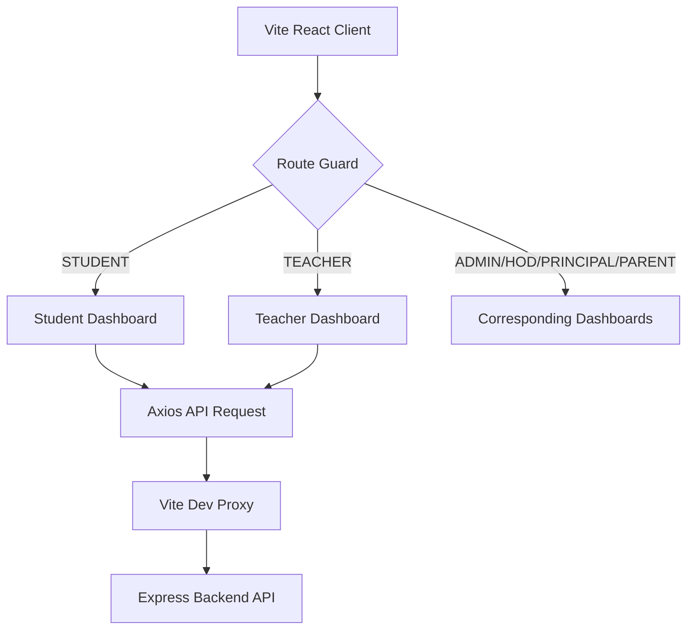

# Frontend Developer Integration & Feature Guide

Welcome to the **College ERP** frontend development team. This document provides a detailed breakdown of the frontend architecture, how to implement each system feature, and how to coordinate with backend developers during development.

---

## 1. Frontend Architecture & Tech Stack

Our frontend is a modern Single Page Application (SPA) built using the following stack:
* **Core Framework:** React 18 with TypeScript (Vite bundler)
* **Styling:** Tailwind CSS (utility-first styles)
* **UI Components:** Material-UI (MUI) v5 for complex dashboard widgets, tables, and layouts
* **State Management:** 
  - **Redux Toolkit:** Used for global application states (e.g., user authentication session, UI theme, global alerts).
  - **Zustand:** Used for lightweight page-specific or module-level state persistence.
  - **React Query:** Used for server cache management, API pagination, and data synchronization.
* **Routing:** React Router v6 (using role-based route guards)

### Directory Structure
```
frontend/
├── src/
│   ├── components/       # Reusable UI components
│   │   ├── common/       # Navbar, Sidebar, Loader, Modal, Button
│   │   ├── charts/       # Recharts wrappers (Attendance, Performance, Fees)
│   │   ├── dashboard/    # StatCard, ActivityFeed
│   │   ├── forms/        # Input validators, multi-step forms
│   │   └── tables/       # Table list renderers
│   ├── constants/        # API endpoints, roles, status constants
│   ├── hooks/            # Custom hooks (useAuth, useApi, useSocket)
│   ├── pages/            # Page layouts separated by RBAC roles
│   │   ├── admin/
│   │   ├── admission/
│   │   ├── hod/
│   │   ├── parent/
│   │   ├── principal/
│   │   ├── student/
│   │   └── teacher/
│   ├── services/         # Axios wrapper and API service classes
│   ├── store/            # Redux Slices (auth, notification, ui)
│   ├── types/            # TypeScript Interface definitions
│   └── utils/            # Helper utils (formatters, validators)
```

---

## 2. Feature-by-Feature Implementation Guide

Here is the breakdown of how the frontend developer will build and connect each core feature.



### Feature 1: Authentication & Role-Based Access Control (RBAC)
* **Description:** Allow users to log in, maintain sessions via JWT, and restrict page views based on their roles (`STUDENT`, `TEACHER`, `HOD`, `PRINCIPAL`, `PARENT`, `ADMIN`).
* **Frontend Tasks:**
  - Build `LoginPage.tsx` with credentials form validation (using `react-hook-form` + `zod`).
  - Implement a `ProtectedLayout.tsx` route wrapper that checks the user's role stored in Redux (`authSlice`).
  - Automatically redirect unauthorized users to `/unauthorized` or back to `/login`.
* **API Handlers to Connect:**
  - `POST /auth/login` (Sends email/password, saves token in localStorage/cookie).
  - `POST /auth/refresh-token` (Interceptors to handle token renewal transparently).

### Feature 2: Multi-Step Online Admission Form
* **Description:** Public-facing multi-step application form for prospective students.
* **Frontend Tasks:**
  - Create a stepper component (`Step 1: Personal Info`, `Step 2: Academics`, `Step 3: Document Upload`).
  - Use `react-hook-form` to validate inputs at each step before moving forward.
  - Implement file uploads using a custom Drag-and-Drop file uploader. Use `multipart/form-data` request envelopes.
* **API Handlers to Connect:**
  - `POST /admission/submit` (Submits form data and S3-uploaded file URLs).
  - `GET /admission/:admissionId` (Allows candidates to fetch validation status updates).

### Feature 3: Student Academic & Financial Portal
* **Description:** Dashboard for enrolled students showing class schedule, current attendance, test marks, and pending payments.
* **Frontend Tasks:**
  - Build cards to display attendance gauges (`recharts` radial bar charts) and GPA trends.
  - Render an interactive weekly timetable.
  - Connect payment buttons to the Razorpay/Stripe checkout library.
* **API Handlers to Connect:**
  - `GET /students/dashboard` (Fetches aggregated student data).
  - `GET /students/attendance` (Fetches detail tables with semester filters).
  - `POST /students/fees/payment/initiate` (Triggers payment gateway order creation).

### Feature 4: Teacher Academic Management
* **Description:** Workspace for teachers to take attendance, grade assignments, and submit exam marks.
* **Frontend Tasks:**
  - Build a responsive spreadsheet-like attendance register table where teachers toggle Present/Absent/Leave checkbox states.
  - Build bulk grade upload components (with XLSX template file parser parsing student roll numbers).
* **API Handlers to Connect:**
  - `GET /teachers/dashboard` (Shows subjects assigned and today's schedule).
  - `POST /teachers/attendance/mark` (Posts class attendance register payload).
  - `POST /teachers/marks/submit` (Posts grade array to database).

### Feature 5: Real-Time Notifications
* **Description:** System notifications sent instantly to users (e.g. low attendance alert to students, fee invoices).
* **Frontend Tasks:**
  - Setup a WebSockets client using `socket.io-client` inside a custom hook (`useSocket.ts`).
  - Establish connection on user login and display floating Toast notification prompts.
  - Build a notifications drop-down component in the main Header.
* **API Handlers to Connect:**
  - `GET /notifications` (Fetches previous history list).
  - Socket event listener: `on('notification', (data) => dispatch(addNotification(data)))`.

---

## 3. Step-by-Step Integration Example: Student Dashboard

Let's look at a concrete development flow example. You are assigned to build the **Student Dashboard Integration**.

### Step A: Define the Data Interface
Create `src/types/dashboard.types.ts` to map the API response payload exactly:
```typescript
export interface StudentDashboardData {
  student: {
    id: string;
    name: string;
    enrollmentNumber: string;
    department: string;
    semester: number;
    profileImage: string;
  };
  attendance: {
    percentage: number;
    status: 'GOOD' | 'WARNING' | 'CRITICAL';
    totalClasses: number;
    classesPresent: number;
  };
  academicInfo: {
    cgpa: number;
    sgpa: number;
  };
}
```

### Step B: Build the API Fetch Client
Create the network layer wrapper `src/services/student.service.ts`:
```typescript
import api from './api'; // Axios instance with JWT interceptor
import { StudentDashboardData } from '../types/dashboard.types';

export const fetchStudentDashboard = async (): Promise<StudentDashboardData> => {
  const response = await api.get<StudentDashboardData>('/students/dashboard');
  return response.data;
};
```

### Step C: Create the Page Component
Create `src/pages/student/StudentDashboardPage.tsx` using Tailwind CSS and Recharts:
```tsx
import React, { useEffect, useState } from 'react';
import { fetchStudentDashboard } from '../../services/student.service';
import { StudentDashboardData } from '../../types/dashboard.types';
import Loading from '../../components/common/Loading';
import StatCard from '../../components/dashboard/StatCard';

const StudentDashboardPage: React.FC = () => {
  const [data, setData] = useState<StudentDashboardData | null>(null);
  const [loading, setLoading] = useState(true);
  const [error, setError] = useState<string | null>(null);

  useEffect(() => {
    fetchStudentDashboard()
      .then((res) => {
        setData(res);
        setLoading(false);
      })
      .catch((err) => {
        setError(err.message || 'Failed to connect to server');
        setLoading(false);
      });
  }, []);

  if (loading) return <Loading />;
  if (error) return <div className="text-red-500 p-6">{error}</div>;
  if (!data) return <div className="p-6">No data found.</div>;

  return (
    <div className="p-6 space-y-6">
      <header className="flex justify-between items-center">
        <div>
          <h1 className="text-2xl font-bold text-slate-100">Welcome back, {data.student.name}</h1>
          <p className="text-slate-400 text-sm">Enrollment No: {data.student.enrollmentNumber}</p>
        </div>
      </header>

      {/* Stats Cards Dashboard Layout */}
      <div className="grid grid-cols-1 md:grid-cols-3 gap-6">
        <StatCard 
          title="Overall Attendance" 
          value={`${data.attendance.percentage}%`} 
          description={`${data.attendance.classesPresent}/${data.attendance.totalClasses} classes attended`}
          status={data.attendance.status}
        />
        <StatCard 
          title="Current CGPA" 
          value={data.academicInfo.cgpa.toFixed(2)} 
          description={`Last semester SGPA: ${data.academicInfo.sgpa.toFixed(2)}`}
        />
        <StatCard 
          title="Department" 
          value={data.student.department} 
          description={`Semester: ${data.student.semester}`}
        />
      </div>
    </div>
  );
};

export default StudentDashboardPage;
```

---

## 4. Frontend Developer Best Practices
1. **Never Hardcode API Hostnames:** Use `import.meta.env.VITE_API_URL` or leverage the Vite configuration proxy.
2. **Handle Loading and Error States:** Never leave a screen completely white during network requests; always wrap calls with a `<Loading />` or inline skeletal component.
3. **TypeScript Strictness:** Always define API inputs and responses using interfaces to catch type mismatch errors during compiler build steps.
4. **CSS Consistency:** Rely strictly on Tailwind tokens and predefined spacing, colors (e.g. `indigo`, `slate`, `emerald`, `rose`), and variables matching the styling guide in the main playbook.
